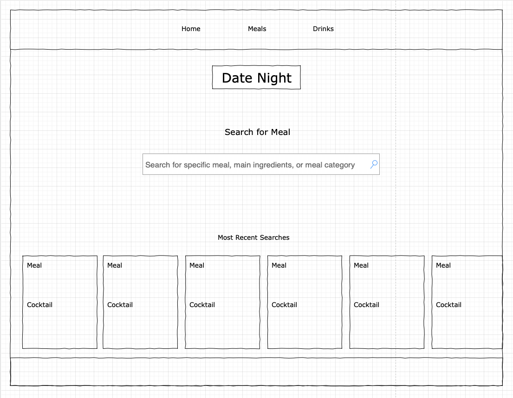
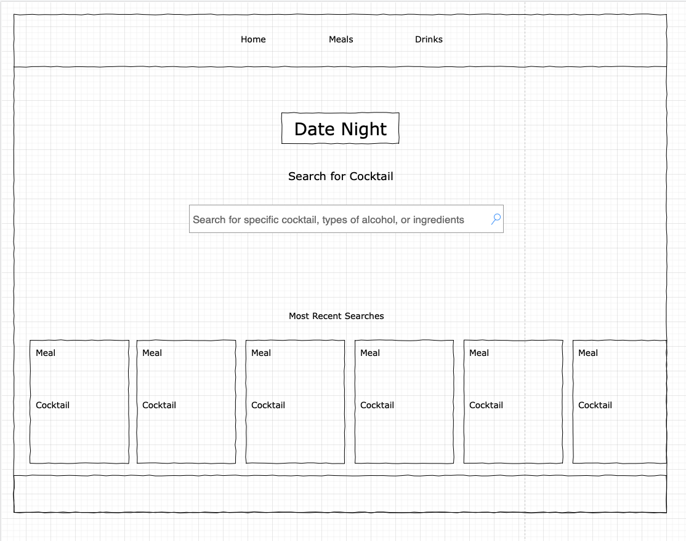
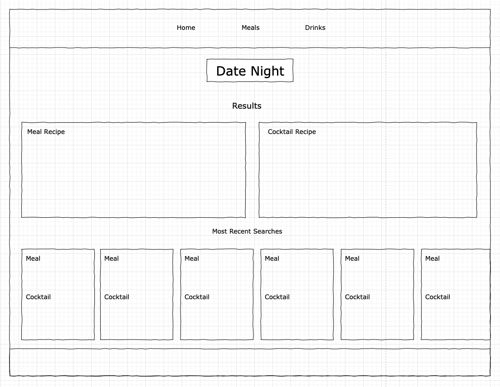

# Date Night Recipes

## Description

When you ask a friend to come over for dinner and drinks
And you want to impress them with your cooking and cocktail skills
You can use this web app to up your game and show them a luxurious meal with fancy drink.

## User Stories

As a  Undecisive Date Planner
I want to Find good recipes 
So that I can cook for date night

As a Undecisive Date Planner
I want to Find good cocktail recipes  
So that I can prepare them for date night

## Wireframe

Home - Meal Search

Next Page - Cocktail Search

Next Page - Results

## User Flow

The user opens up webpage
#### Page 1 Meal Search
They are asked to search for a specific meal, main ingredient to a meal, or meal category

#### Page 2 Cocktail Search
They are asked to search for a specific cocktail, type of alcohol in cocktail, specific ingredient in cocktail

#### Page 3 
The user will now be shown a meal recipe and a cocktail recipe based on the user search

#### Other Functionality
The user will also be able to save recipes that they like as well

## APIS To Be Used

The CocktailDB API
https://www.thecocktaildb.com/api.php

The Meal API
https://www.themealdb.com/api.php

## Rough Breakdown

